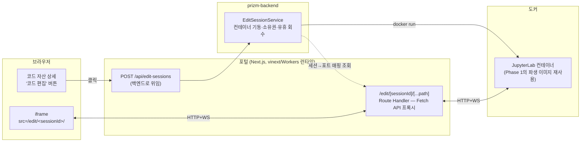
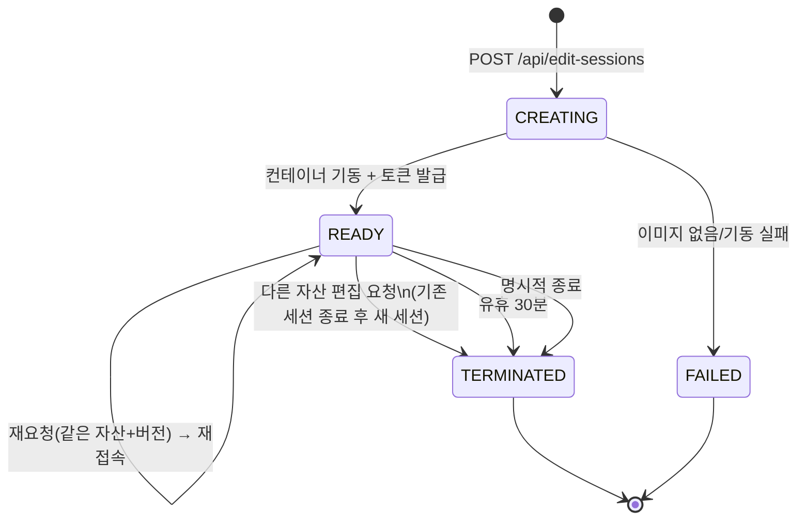
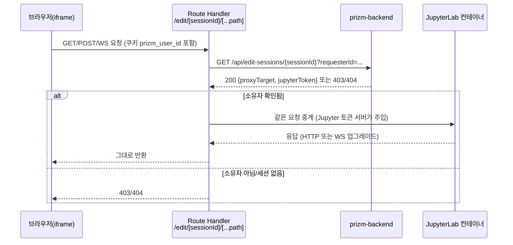

# JupyterLab 편집 세션 설계 (Phase 2)

- 작성일: 2026-09-19
- 상태: 설계 확정 대기
- 관련 문서: `2026-09-19-notebook-edit-environment-design.md`(Phase 1 — 이미 구현 완료, `prizm-backend` main `0695f54`)

## 1. 배경과 목표

코드 자산 상세 화면의 "코드 편집" 버튼이 등록된 Notebook을 브라우저에서 바로 수정할 수 있는
환경(Colab과 같은 경험)을 열어준다. Phase 1에서 만든 파생 이미지 빌드 파이프라인을 그대로
재사용해, 편집 세션의 커널이 실행과 정확히 같은 환경(같은 파생 이미지)에서 돈다.

에디터 UI는 직접 만들지 않는다 — JupyterLab을 iframe으로 삽입하고, 상단 헤더·우측 레일
같은 틀만 PRIZM 자체 UI로 감싼다. 셀 편집·실행·출력 렌더링·커널 프로토콜을 직접 구현하는
것보다 구현량이 압도적으로 적다(Phase 1 브레인스토밍에서 이미 비교·결정됨).

## 2. 확정된 결정

| 항목 | 결정 | 근거 |
|---|---|---|
| 사용자 식별 | **가상 사용자 식별자 도입** — 첫 방문 시 포털이 HttpOnly 쿠키(`prizm_user_id`, 랜덤 UUID)를 심는다 | 이 앱엔 실제 인증이 없다(`RunService.REQUESTED_BY`가 "이학선"으로 하드코딩). 지금은 쿠키가 항상 사번 2959052(이학선 / 기아 / 제조AI기술개발팀) 프로필 하나로 매핑되지만, 세션 소유권 판정 로직 자체는 "쿠키 = 사용자"로 짜서 나중에 실제 여러 사람이 붙어도 이 부분은 안 바뀐다 |
| 동시 세션 | **사용자당 세션 1개 — 다른 자산을 편집하면 기존 세션을 종료하고 새로 연다** | 컨테이너 1개만 뜨는 게 자원 관리상 가장 단순하다. 종료 전 드래프트를 MinIO로 flush하므로 데이터는 잃지 않는다 |
| 프록시 위치 | **포털(Next.js)이 직접 프록시** | JupyterLab을 iframe과 동일 오리진(`localhost:3000`)으로 보이게 하려면 포털이 중계해야 한다 — 백엔드가 중계해도 포털과는 다른 오리진이라 iframe CSP·쿠키 문제가 그대로 남는다 |
| Jupyter 자체 토큰 | **브라우저에 절대 노출하지 않는다** | 프록시가 백엔드에서 받은 실제 토큰을 서버 사이드로 매 요청마다 주입한다. iframe의 `src`엔 시크릿이 전혀 없다 |

### 설계자 판단으로 결정한 사항

**배포 환경 범위**: `prizm-portal`의 `start` 스크립트가 `wrangler dev`(Cloudflare Workers)를 쓰고
`vinext`(Cloudflare가 만든 "Next.js를 Vite/Workers 런타임 위에서 돌리는" 도구)가 `dev`도
Workers 호환 런타임(`nodejs_compat` 플래그, `vinext/server/fetch-handler`)으로 돌린다는 걸
확인했다. 이번 설계는 **로컬 개발 환경만 다룬다** — 실제 운영 배포(Cloudflare 에지에서 로컬
Docker 컨테이너에 어떻게 닿을지)는 완전히 별개 과제이며 이 문서 범위 밖이다.

## 3. 전체 아키텍처

포털은 세션 생성 요청을 백엔드로 그대로 위임하고, 컨테이너 기동·소유권 판정·유휴 회수는
전부 백엔드가 맡는다. 포털의 몫은 순수 중계(프록시)뿐이다.

## 4. 세션 생성·수명주기

**생성 흐름** (`POST /api/edit-sessions {assetId, version}`):

1. 쿠키의 `prizm_user_id`로 기존 활성 세션이 있는지 확인
   - 같은 (자산, 버전)이면 그 세션 정보를 그대로 반환(컨테이너 재사용, 즉시 접속)
   - 다른 (자산, 버전)이면 기존 세션을 종료(드래프트를 MinIO로 flush 후 컨테이너 정지)하고 새로 생성
2. Phase 1의 `EnvironmentService`/`BaseImageResolver`로 이 자산의 파생 이미지가 `READY`인지
   확인한다(아니면 409 — Phase 1의 "실행 환경이 아직 준비되지 않았습니다"와 같은 패턴)
3. MinIO에서 대상 `.ipynb`를 세션 작업 디렉터리(`<host>/edit-sessions/<sessionId>/`, Phase 1의
   `runs/` 패턴 재사용)로 복사
4. `docker run`으로 그 파생 이미지에서 JupyterLab을 기동한다 — 도구 venv의
   `jupyter lab --NotebookApp.token=<1회용> --NotebookApp.base_url=/edit/<sessionId>/
   --notebook-dir=<마운트 경로>`
   - **Phase 1에서 도구 venv엔 papermill만 설치했고 jupyterlab이 없다.** 베이스 런타임
     이미지(`runtime/base/Dockerfile`)의 도구 venv에 jupyterlab·jupyter-server를 추가하는
     것이 Phase 2의 실제 구현 항목이다. 사용자 환경(site-packages)은 건드리지 않는다 —
     Phase 1 §4.6의 격리 원칙을 그대로 따른다
5. 컨테이너가 응답할 때까지 짧게 폴링한 뒤 `READY`, sessionId와 프록시 대상을 포털에 반환

**드래프트 vs 버전**: 세션 동안의 모든 저장은 마운트된 호스트 디렉터리(=드래프트)에만
쓰인다. 백엔드가 주기적으로(또는 세션 종료 시) 그 파일을 MinIO의 드래프트 경로로 올린다.
"새 버전으로 등록" 버튼을 눌러야 그 시점 드래프트가 AI Hub에 새 버전으로 등록된다 — 이
버튼을 눌러도 세션은 끊기지 않고 계속 편집할 수 있다. 기존 버전은 불변이다.

## 5. 프록시·인가

**인가는 매 요청마다 백엔드에 확인한다(캐싱 없음).** JupyterLab은 폴링이 잦아 백엔드 호출이
늘어나지만, 로컬 단일 사용자 프로토타입에서 이 왕복은 무시할 수준이다. 실제로 느려지면
그때 세션→대상 매핑을 캐싱한다 — 지금 미리 캐싱을 넣는 건 YAGNI다.

**WebSocket**: Route Handler가 `Upgrade: websocket` 헤더를 감지하면 `fetch()`로 JupyterLab
컨테이너에 같은 헤더로 요청해 응답의 `webSocket`을 받아 브라우저 쪽 소켓과 연결한다.

### ⚠️ 검증이 필요한 리스크

WebSocket 프록시가 `vinext dev`의 Workers 스타일 로컬 런타임(workerd/miniflare 기반)에서
`fetch()` + `WebSocketPair`로 임의의 `http://localhost:<포트>` 대상(다른 Worker가 아닌 실제
JupyterLab 프로세스)에 실제로 통하는지 아직 손으로 검증하지 못했다. **구현 계획의 첫
태스크를 이 검증에 할당한다**(더미 WebSocket 에코 서버를 도커로 띄우고 Route Handler로
중계해 브라우저에서 메시지를 주고받는지 확인) — 실패하면 이 섹션의 WS 부분만 다른 구조로
바뀐다(예: 백엔드가 직접 프록시하고 iframe은 CORS 허용으로 타협, 동일 오리진은 포기).
이 검증이 실패하면 나머지 설계(세션 생성·인가·정리)는 그대로 유효하고 프록시 계층만
다시 설계하면 된다.

## 6. 에러 처리·정리

- **백엔드 재시작 중 컨테이너 고아 문제**: Phase 1의 `BUILDING` 고착과 같은 종류의 문제다.
  `EditSession`을 DB에 영속화(H2, Phase 1 패턴 재사용)하고, 컨테이너엔
  `prizm-edit-session=<sessionId>` 라벨을 붙인다. 기동 시 리컨사일러가
  `docker ps --filter label=...`로 실제 살아있는 컨테이너와 DB 상태를 맞춘다 — DB는
  `READY`인데 컨테이너가 없으면 `TERMINATED`로 정리한다.
- **컨테이너가 죽었는데 프록시로 요청이 오면**: 연결 거부를 그대로 502로 흘리지 않고
  "편집 세션 연결이 끊겼습니다, 다시 시작해 주세요" 같은 한국어 메시지로 바꾸고, 그 시점에
  세션을 `TERMINATED`로 표시한다(다음 요청부터는 바로 404).
- **유휴 회수**: Phase 1의 `@Scheduled` 폴링 패턴을 재사용한다. 30분간 활동이 없으면
  `docker stop/rm` → `TERMINATED`.

> **구현 계획 작성 중 발견해 반영한 정정**: 실제 AI Hub SDK(`mlops`, 이후 `prizm`으로 개명)에는
> "드래프트로 저장"하는 별도 기능이 없다 — `code.upload()`가 호출되는 즉시 새 버전이 만들어진다.
> 그래서 위 "드래프트를 MinIO로 flush"는 실제로 구현할 수 없는 기능이었다. 대신 **세션 종료
> (유휴 회수·다른 자산으로 전환) 시 호스트 세션 디렉터리를 그대로 삭제한다** — "새 버전으로
> 등록"을 누르지 않은 편집 내용은 이 시점에 사라진다. 이는 사용자 승인을 받은 명시적 결정이다.
> 자세한 내용은 `docs/superpowers/plans/2026-09-19-jupyterlab-edit-session.md` Task 6을 참고.
- **테스트 전략**: 백엔드는 Phase 1과 동일하게 `CommandRunner` seam으로 `docker run/stop`을
  격리해 Mockito 단위 테스트를 짠다. Route Handler(TypeScript)는 이 프로젝트 관행대로
  테스트 프레임워크 없이 `tsc`+`oxlint`, 실제 프록시·WS 동작은 Playwright E2E로 검증한다
  (에디터 열기 → 커널 연결 → 셀 실행 → 출력 확인).

## 7. 이번 범위에서 제외

- 실제 운영 배포(Cloudflare 에지 ↔ 로컬 Docker 컨테이너 연결) — §2의 범위 결정 참고
- 동시 협업 편집(여러 사용자가 한 노트북을 동시에)
- 편집 환경 내 터미널 접근
- 실제 인증(현재는 가상 사용자 식별자 1명 프로필만 존재)
- 세션 개수 상한·과금·리소스 쿼터

## 8. Phase 1과의 의존 관계

- `EnvironmentService`·`BaseImageResolver`·`CommandRunner`(Phase 1, `prizm-backend`
  `environment` 패키지)를 그대로 재사용한다 — 새로 만들지 않는다.
- 베이스 런타임 이미지(`runtime/base/Dockerfile`)에 jupyterlab·jupyter-server를 추가하는
  것이 유일하게 Phase 1 산출물을 수정하는 지점이다(도구 venv 안에서만, 사용자 환경은
  그대로).
- `EditSession` 엔티티·리컨사일러·유휴-회수 스케줄러는 Phase 1의 `EnvironmentBuild`·
  `EnvironmentBuildReconciler`·`EnvironmentService.processPendingBuilds()`와 정확히 같은
  패턴을 따른다 — 새 패턴을 발명하지 않는다.
